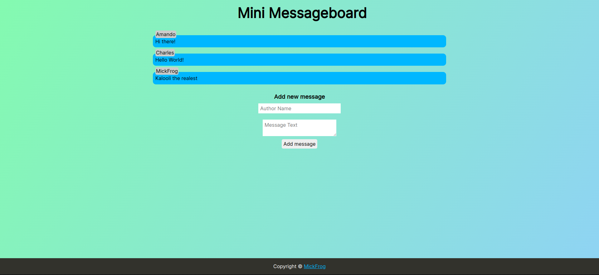
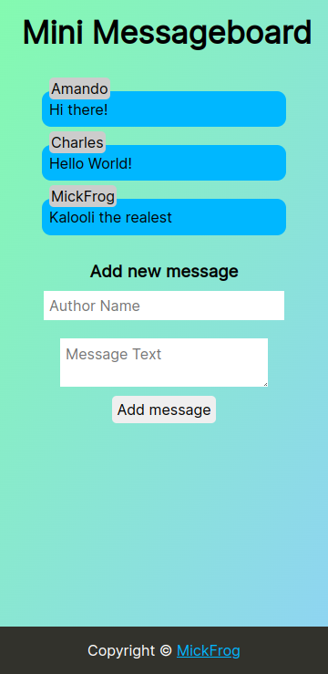

# Mini message-board

This is a simple fullstack project that is similar to a chat room where users can come and add their messages anonymously.

The live app can be checked out [here](https://message-board-production-b120.up.railway.app/)

## Features

1. Responsive design
2. Anonymous messaging

## Previews

### Desktop



### Mobile



## Project Setup

1. Clone Project

```
git clone git@github.com:MickFrog/message-board.git
cd message-board
npm install
npm run serverstart
```

2. Set Environment Variable

- Create a .env file and add the following variable(s).

```
MONGO_KEY={your mongoDB connection string}
```

## Built with

- NodeJS
- Express.js
- MongoDB
- Mongoose
- EJS
- HTML5
- CSS3
